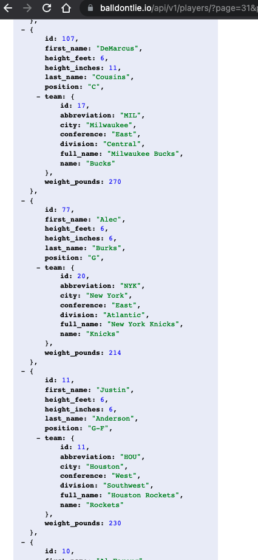
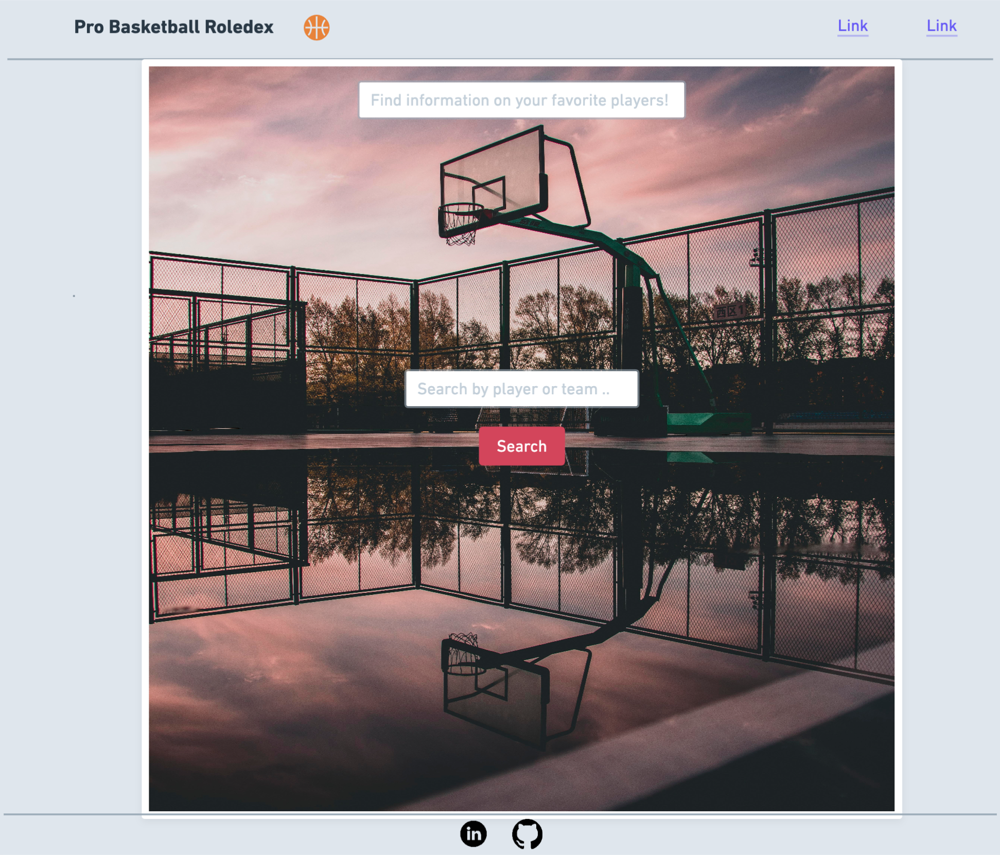
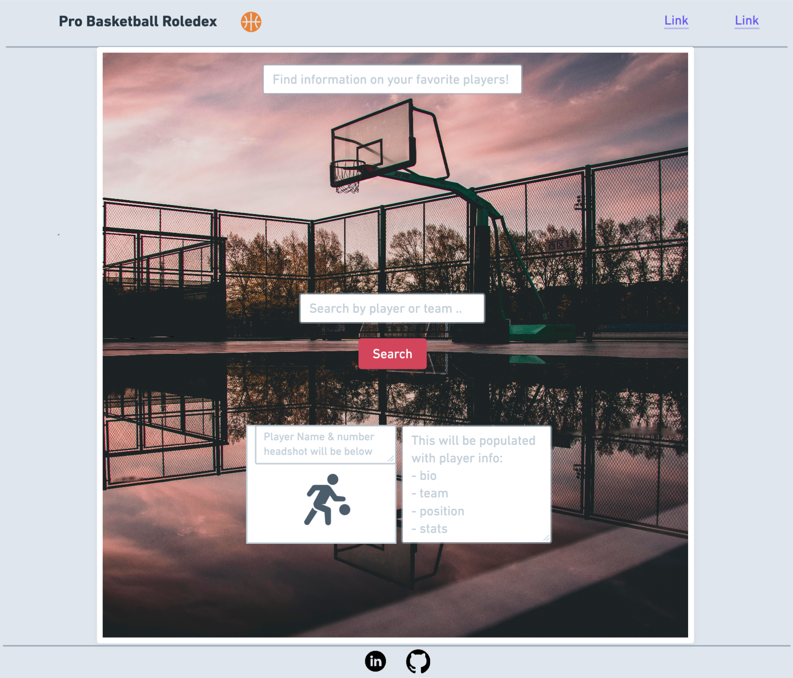
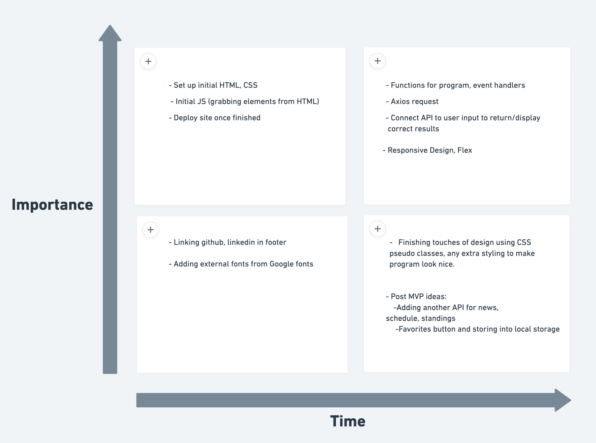

# Project Overview

## Project Name

<h3>Pro Basketball Roledex</h3>

## Project Description

A place to search NBA players & teams and get relevant information about them (photo, position, stats, height, weight, team, conference, division)

## API and Data Sample



## Wireframes

This image below will be what the the user sees initially. They will be able to input a player name or team and get results based on their search.



This second image will be what the page looks like when the results of the user search are returned.



### MVP/PostMVP

#### MVP

- Find and use external api
- Get back information on pro basketball players and teams, including headshot, stats, team, position, bio.
- Render player/team data on page based on what the user searched.

#### PostMVP

- Add a favorites button so users can keep track of their favorite players/team.
- Use local storage to save user favorites
- Add another API for news around the league, schedule, standings.

## Project Schedule

This schedule will be used to keep track of your progress throughout the week and align with our expectations.

You are **responsible** for scheduling time with your squad to seek approval for each deliverable by the end of the corresponding day, excluding `Saturday` and `Sunday`.

| Day       | Deliverable                                        | Status     |
| --------- | -------------------------------------------------- | ---------- |
| Dec 10-12 | Prompt / Wireframes / Priority Matrix / Timeframes | Incomplete |
| Dec 13    | Project Approval                                   | Incomplete |
| Dec 13    | Core Application Structure (HTML, CSS, etc.)       | Incomplete |
| Dec 14    | Pseudocode / actual code                           | Incomplete |
| Dec 15    | Initial Clickable Model                            | Incomplete |
| Dec 16    | MVP                                                | Incomplete |
| Dec 17    | Presentations                                      | Incomplete |

## Priority Matrix



## Timeframes

Tell us how long you anticipate spending on each area of development. Be sure to consider how many hours a day you plan to be coding and how many days you have available until presentation day.

Time frames are also key in the development cycle. You have limited time to code all phases of the game. Your estimates can then be used to evalute game possibilities based on time needed and the actual time you have before game must be submitted. It's always best to pad the time by a few hours so that you account for the unknown so add and additional hour or two to each component to play it safe. Throughout your project, keep track of your Time Invested and Actual Time and update your README regularly.

| Component                                    | Priority | Estimated Time | Time Invested | Actual Time |
| -------------------------------------------- | :------: | :------------: | :-----------: | :---------: |
| Set up page with HTML                        |    H     |      2hrs      |      --       |     --      |
| CSS set up                                   |    H     |      2hrs      |      --       |     --      |
| JS intial set up (grabbing html elements)    |    H     |      1hrs      |      --       |     --      |
| Connect API using Axios                      |    H     |      4hrs      |      --       |     --      |
| Implement JS event handler(s)                |    H     |      3hrs      |      --       |     --      |
| JS functions - userinput, player info, teams |    H     |      4hrs      |      --       |     --      |
| Use API to display player info to page       |    H     |      4hrs      |      --       |     --      |
| Use API to display team rosters              |    H     |      3hrs      |      --       |     --      |
| Style page using CSS/flex                    |    H     |      4hrs      |      --       |     --      |
| Implement responsive design                  |    H     |      3hrs      |      --       |     --      |
| Add/link second html file for PostMVP        |    H     |      1hrs      |      --       |     --      |
| Add styling finishing touches                |    H     |      3hrs      |      --       |     --      |
| Link icons/images on page                    |    H     |      1hrs      |      --       |     --      |
| Debug program                                |    H     |      3hrs      |      --       |     --      |
| Clean up code                                |    H     |      3hrs      |      --       |     --      |
| Deploy site                                  |    H     |      1hrs      |      --       |     --      |
| Total                                        |    H     |     42hrs      |      --       |     --      |

## Code Snippet

Use this section to include a brief code snippet of functionality that you are proud of and a brief description.

```
function reverse(string) {
	// here is the code to reverse a string of text
}
```

## Change Log

Use this section to document what changes were made and the reasoning behind those changes.
