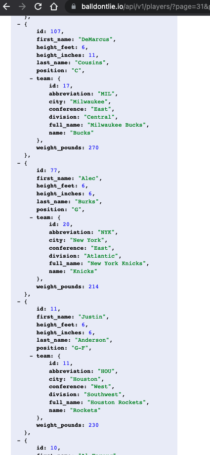
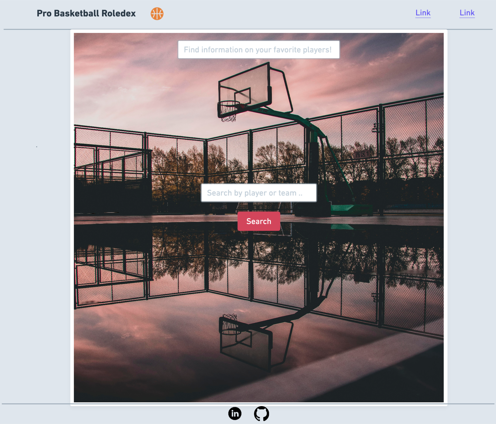
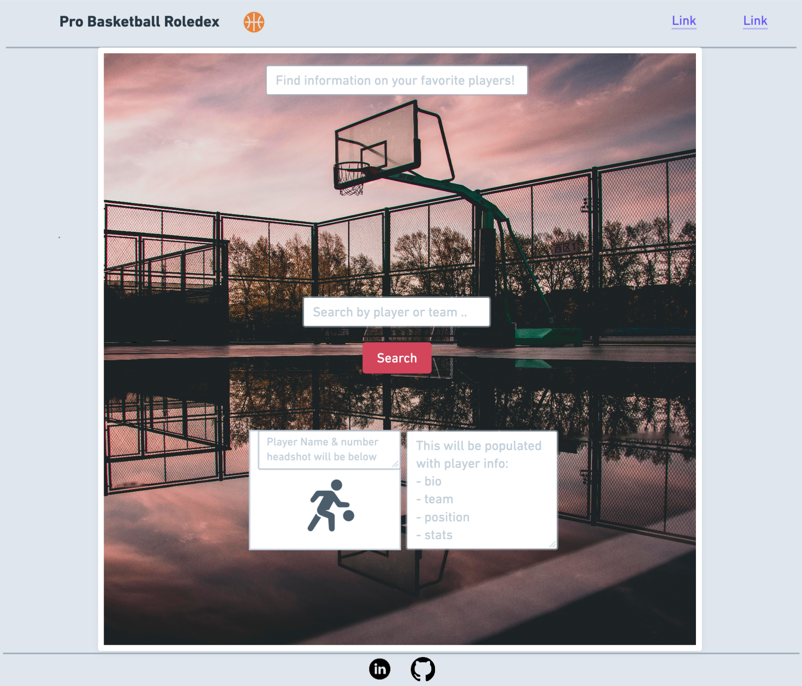
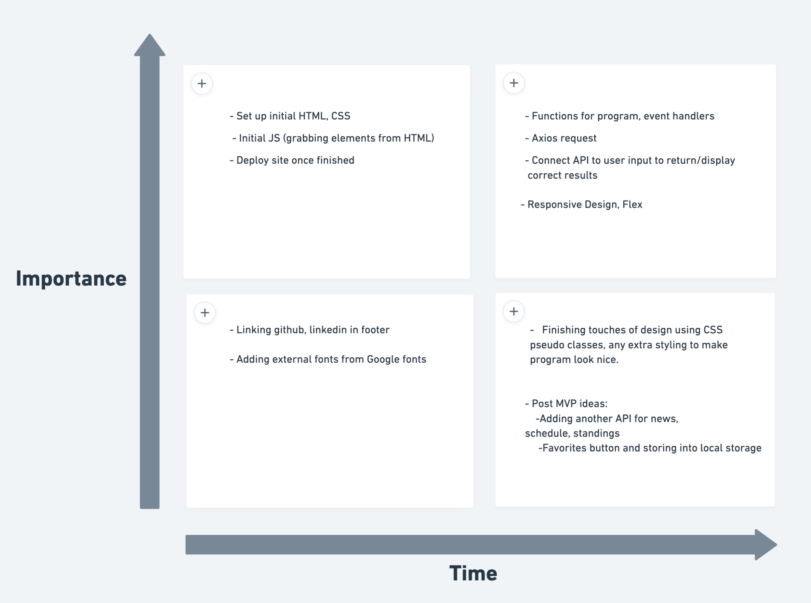
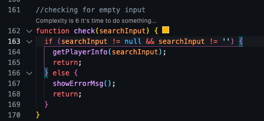

# Project Overview

## Project Name

<h3>Pro Basketball Rolodex</h3>

## Project Description

A place to search NBA players & teams and get relevant information about them (Name, position, stats, height, weight, team, conference, division)

## API and Data Sample

## Wireframes

This image below will be what the the user sees initially. They will be able to input a player name or team and get results based on their search.

This second image will be what the page looks like when the results of the user search are returned.

### MVP/PostMVP

#### MVP

- Find and use external api
- Get back information on pro basketball players and teams, including their stats, conference, divison, team, position, bio.
- Render player/team data on page based on what the user searched.

#### PostMVP

- Add another API for headshots,news around the league, schedule, standings.
- Add a favorites button so users can keep track of their favorite players/team.
- Use local storage to save user favorites

## Project Schedule

This schedule will be used to keep track of your progress throughout the week and align with our expectations.

You are **responsible** for scheduling time with your squad to seek approval for each deliverable by the end of the corresponding day, excluding `Saturday` and `Sunday`.

| Day       | Deliverable                                        | Status   |
| --------- | -------------------------------------------------- | -------- |
| Dec 10-12 | Prompt / Wireframes / Priority Matrix / Timeframes | Complete |
| Dec 13    | Project Approval                                   | Complete |
| Dec 13    | Core Application Structure (HTML, CSS, etc.)       | Complete |
| Dec 14    | Pseudocode / actual code                           | Complete |
| Dec 15    | Initial Clickable Model                            | Complete |
| Dec 16    | MVP                                                | Complete |
| Dec 17    | Presentations                                      | Complete |

## Priority Matrix

## Timeframes

| Component                                    | Priority | Estimated Time | Time Invested | Actual Time |
| -------------------------------------------- | :------: | :------------: | :-----------: | :---------: |
| HTML set up                                  |    H     |      2hrs      |     2hrs      |    2hrs     |
| CSS set up                                   |    H     |      2hrs      |     2hrs      |    2hrs     |
| JS initial set up (grabbing html elements)   |    H     |      1hrs      |     1hrs      |    1hrs     |
| Connect API using Axios                      |    H     |      4hrs      |     4hrs      |    4hrs     |
| Implement JS event handler(s)                |    H     |      3hrs      |     4hrs      |    4hrs     |
| JS functions - userinput, player info, teams |    H     |      4hrs      |     5hrs      |    5hrs     |
| Use API to display player info to page       |    H     |      4hrs      |     4hrs      |    4hrs     |
| Use API to display team rosters              |    H     |      3hrs      |     5hrs      |    5hrs     |
| Style page using CSS/flex                    |    H     |      4hrs      |     5hrs      |    5hrs     |
| Implement responsive design                  |    H     |      3hrs      |     3hrs      |    3hrs     |
| Add styling finishing touches                |    H     |      3hrs      |     3hrs      |    3hrs     |
| Link icons/images on page                    |    H     |      1hrs      |     1hrs      |    1hrs     |
| Debug program                                |    H     |      3hrs      |     4hrs      |    4hrs     |
| Clean up code                                |    H     |      3hrs      |     1hrs      |    1hrs     |
| Deploy site                                  |    H     |      1hrs      |     .5hr      |    .5hr     |
| Total                                        |    H     |     41hrs      |    44.5hrs    |   44.5hrs   |

## Code Snippet

I chose this snippet because it gave me the most grief. I probably reviewed every lesson we had and more stackoverflow pages that I can remember but after hours of messing around with it, this is how it finally worked correctly.

.

## Change Log

1. Changed the background image. I changed this because I found an image that I liked more and also fit better on the screen.
2. PostMVP - I wasnt able to find an API for team logos, so I grabbed them from giphy and manually implemented them.
3. Player photos - I still plan on finding an api and adding them when a user searches a player.
